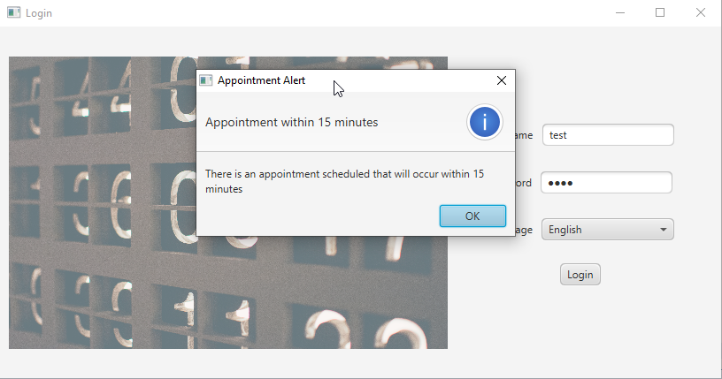
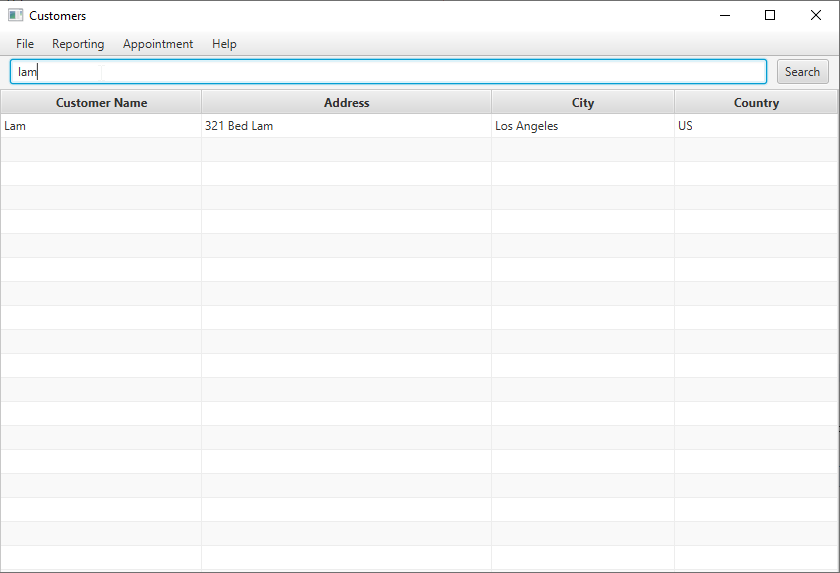
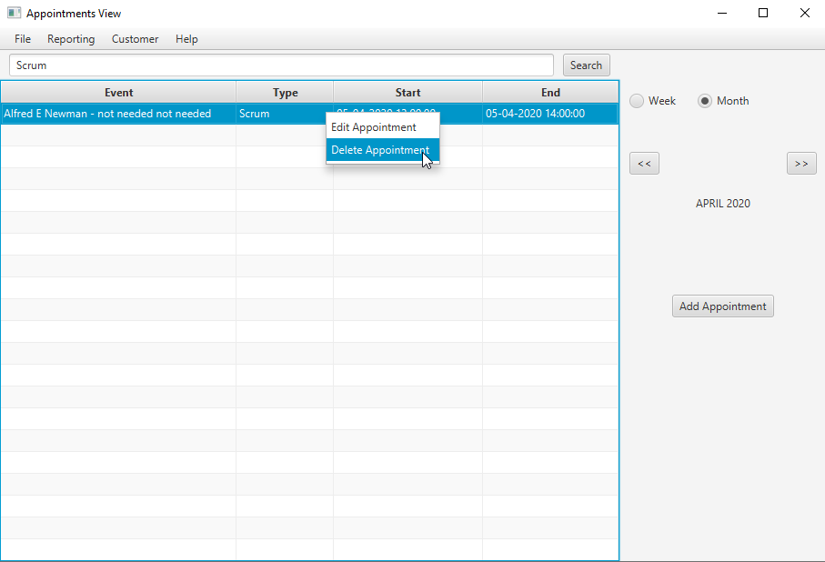

# AppointmentManager
JavaFx foray into appointment management

School Project for a consulting firm to manage customer and appointment data between various brances in different countries.

### Features
- Appointment Reminders for appointments within 15 minutes, adjusted to local timezone.
- Language configuration option to enable full translation.
- All search options are bound to typing events, (no need to press "Search")
- Individual right-click context menu between screens.
- Mulit-threaded approach to data update and computation to prevent bogging down UI thread.

  

  

  

  
### Design Documents
- Design documents for user stories as well as implementation details([Link to Docs](https://drive.google.com/file/d/1CyQOQw7hLA4BN2DHC0OGCUzDVSZYyfzS/view?usp=sharing))